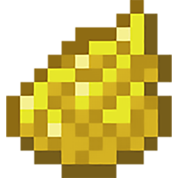
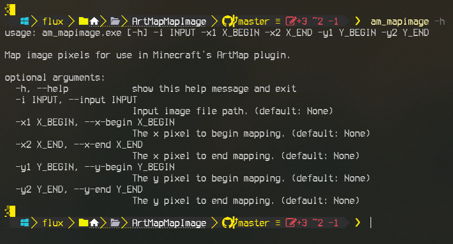

<!-- ***This project is*** ![Under Construction](https://img.shields.io/static/v1?logo=data:image/png;base64,iVBORw0KGgoAAAANSUhEUgAAAA4AAAAOCAYAAAAfSC3RAAACmElEQVQokUWSa0iTcRTGn//26u4b6ZQ0U8lKMqykwPpgZVBEHyLp8jEoIZJADCQ0iCiStIwuZmHRioIuroQss2VkrkIrdeFckiZqdhctTXPOve8Tr7M6X8/zO+fwPEfIwy7IwQA0GgExGYQwyhCmMLRX1z2hJCJSN+xZgqAZnPgCaAUQ0EHICjSYLlKBCDdNQb7HLmeRoy3zQFnzYk/1WTckGUIXCVD+Kw+BpAxtuBXCpkN7bdXt/JL3W3J3xuHg3iTsL/NkNFWVPoWkQOj/wxooCrRhFgiTjI4n9ZVHHQObjxVEY8UGIi1zEhVFCahwdq5qvn+hHkKC0EcBigxwvAnkW3ge7L6TMi+VztOLOOKOY8ulKL68GM2emnjeLF3AZSlz2FCZ6yaHwLGv6pkv8MyxsUoHLcsLwBuHwE0rtdy2UuLWNTpmpkkszQEfnAPDAd47tbaB7NaJR+eXujfmtGTUXgFWp5uwPd8Oi1GBJEmwWYlP34L4PSFw7chPeD+MYnkWUVmy0CeNfe5N8ANIjNWpNmHzqklYrDIGRwRm2gXsM/xofRMOf1AgcbYOAfgxMvgxCmS9+dbh5A6VarxuIMdBDoJ0g+vSreytNpAEux7qqWrK82I+kC2xYOAzyFbz5QNJPrXhdRo4XK/n3WILkxPsbKqwsr8xBB3PjukhGyJJv+qqB+QvkN0mR2Fim5pU1hobzxTYOPbcyJoTNpoAlu6wdZKvIslR0O9VXe0Clc5p2Ge4WDh36ux3ThM/1RqnNhXvilU32cjvINtAf4cKdkzlSHpBTqgNY11JfLtFA+o14NU8Wx/piggNfg2yGVR8EF9/dP37PyCIoDQLs8z9hmv71nsC4wFz9klX2tD4/AEG+gBoQ7KghD8MZ2xdnt7s7wAAAABJRU5ErkJggg==&label=Under&message=Construction&style=for-the-badge&labelColor=1D1D1D&color=ffff99)***, but coming very soon.*** -->

- [About](#about)
  - [Description](#description)
  - [Minecraft ArtMap Plugin](#minecraft-artmap-plugin)
  - [Motivation](#motivation)
- [Usage](#usage)
  - [Environment](#environment)
  - [How To Use](#how-to-use)
  - [Examples](#examples)
- [Project Information](#project-information)
  - [Changelog](#changelog)
    - [Coming Updates](#coming-updates)
  - [Source File Quality](#source-file-quality)
  - [File MD5 Hashes](#file-md5-hashes)
    - [Current Windows MD5](#current-windows-md5)
  - [Other Miscellaneous File Information](#other-miscellaneous-file-information)
- [Notes](#notes)
  - [Note 1](#note-1)
- [Media](#media)
- [Support Me If You Like](#support-me-if-you-like)
- [LICENSE](#license)


---

## About

This is part of a "ArtMap Suite" of tools for which the root of the project can be found here:

[https://github.com/Lateralus138/ArtMapSuite](https://github.com/Lateralus138/ArtMapSuite)

### Description

ArtMap Map Image (*am_mapimage*) is a command line tool created specifically for the Minecraft plugin "ArtMap". This tool reads and returns the hexadeciaml color values of each pixel of an image.

While this tool can be used by itself it is best used with the first tool in this suite called 'ArtMap Closest'. You would read the pixel colors with this tool and then feed the results to *am_closest.exe* which would then return the closest color that the ArtMap plugin provides for each pixel.

ArMap Closest can be found here:

[https://github.com/Lateralus138/ArtMapMapImage](https://github.com/Lateralus138/ArtMapMapImage)

### Minecraft ArtMap Plugin

The Minecraft ArtMap plugin is maintained here:
[https://gitlab.com/BlockStack/ArtMap](https://gitlab.com/BlockStack/ArtMap)
and as such more information about the plugin can be found there.

I use this plugin when playing on the Minecraft server ***Creation Nation***:

play.cnation.net

or

buzz.cnation.net


### Motivation

Doing art with this plugin is fun, but can be a long and tedious chore and I needed tools to help me streamline the process.

---

## Usage

All files can be found in the [Releases](https://github.com/Lateralus138/ArtMapMapImage/releases) tab/section.

### Environment

This is a command line tool with arguments and as such can be run from any console/terminal, Run, shortcut, AutoHotkey, or any other method of launching a console application. I only have a Windows version for now, but I do plan to convert for Linux.

### How To Use

As with any portable program this can be placed anywhere you like on your machine, but more preferably in a directory that is in your `%PATH%` environment variable so you can run it without a full path (`am_mapimage` for example). I recommend using a dedicated *Bin* directory, but of course, it's your choice. If your path isn't already in your `%PATH%` environment then I suggest adding it<sup>[[1](#note-1)]</sup>, but if not then you have provide the full path (`C:\Path\To\am_mapimage.exe` for example) when executing the program.

This can be used by itself, but is best used with another tool: *ArtMap Map Image* (*am_mapimage*, coming soon).

### Examples

Get Help

```Powershell
PS> am_mapimage -h
usage: am_mapimage.exe [-h] -i INPUT -x1 X_BEGIN -x2 X_END -y1 Y_BEGIN -y2 Y_END

Map image pixels for use in Minecraft's ArtMap plugin.

optional arguments:
  -h, --help            show this help message and exit
  -i INPUT, --input INPUT
                        Input image file path. (default: None)
  -x1 X_BEGIN, --x-begin X_BEGIN
                        The x pixel to begin mapping. (default: None)
  -x2 X_END, --x-end X_END
                        The x pixel to end mapping. (default: None)
  -y1 Y_BEGIN, --y-begin Y_BEGIN
                        The y pixel to begin mapping. (default: None)
  -y2 Y_END, --y-end Y_END
                        The y pixel to end mapping. (default: None)
```

Read a square of 16 pixels from X1 = 1, X2 = 4, Y1 = 1, and Y2 = 4

```Powershell
PS> am_mapimage -i C:\Path\To\Image.png -x1 1 -x2 4 -y1 1 -y2 4
0xf6f194
0xf8f19c
0xf8f1a1
0xf3ee7c
0xf6f193
0xf8f19b
0xf8f1a1
0xf2ee79
0xf6f092
0xf8f19b
0xf8f1a2
0xf2ee79
0xf6f092
0xf8f19a
0xf8f1a1
0xf3ee7e
```

Feed output to *am_closest* in Powershell

```Powershell
PS> am_closest @($(am_mapimage -i C:\Path\To\Image.png -x1 1 -x2 4 -y1 1 -y2 4))
Pumpkin Seeds
Pumpkin Seeds
Pumpkin Seeds
Pumpkin Seeds
Pumpkin Seeds
Pumpkin Seeds
Pumpkin Seeds
Pumpkin Seeds
Pumpkin Seeds
Pumpkin Seeds
Pumpkin Seeds
Pumpkin Seeds
Pumpkin Seeds
Pumpkin Seeds
Pumpkin Seeds
Pumpkin Seeds
```

---

## Project Information

&#x54;&#x68;&#x69;&#x73;&#x20;&#x70;&#x72;&#x6f;&#x6a;&#x65;&#x63;&#x74;&#x20;&#x69;&#x73;&#x20;&#x77;&#x72;&#x69;&#x74;&#x74;&#x65;&#x6e;&#x20;&#x69;&#x6e;&#x20;`Python`.

[![Python](https://img.shields.io/endpoint?url=https://raw.githubusercontent.com/Lateralus138/ArtMapMapImage/master/docs/json/python.json&logo=data%3Aimage%2Fpng%3Bbase64%2CiVBORw0KGgoAAAANSUhEUgAAABAAAAAQCAMAAAAoLQ9TAAAAIGNIUk0AAHomAACAhAAA%2BgAAAIDoAAB1MAAA6mAAADqYAAAXcJy6UTwAAAHFUExURQAAAE6NwEqGujxxnjdolgAAAAAAAAAAAAAAAAAAAE6PxEyKv0iFtkN9rT10oTlsljZmkAAAAAAAAFKRxv3dSvnVPgAAADJghwAAAP3VNgAAADVokgAAAOzORQAAADZpkxsxRQAAAAAAAOLDRf3ZQQAAAEaBsjZnkQAAAPLhbv3pav3LG0N9rhwyS%2FXjb%2FPBGkB1oz1zogAAAMKaEgAAAAAAAAAAAAAAAAAAAOjHPevFNOvCKuu%2BIeu7GMabEgAAAAAAAAAAAAAAAAAAAAAAAAAAAP3eTgAAAAAAAAAAAAAAAPHQP%2FrTOf3SL%2FrHGcCXEgAAAAAAAAAAAAAAAAAAAAAAAEiDtER%2BrUB4p0yKvP%2F%2F%2F0V%2Fr0F5qD50ojpvmzZplEmFt0aAsUJ7qj51oztwnTdqljhsl0%2BNwUuIu0R9rUB4pj1zoDltmf%2FiVVCPw0yJvEiEtT10of%2FeS%2F%2FaQU2LvkaAsDtwnP%2FaQv%2FWN%2F%2FTLUqHuUeBskN8qz92pf%2FXOP%2FPI%2F%2FmYf%2FjV%2F%2FfTf%2FbQv%2FTLv%2FPJP%2FrbP%2FnYf%2FbQ%2F%2FXOf%2FMHDpwnP%2FnYv%2FjWP%2FfTv%2FTL%2F%2FbRP%2FXOv%2FTMP%2FQJf%2FYOv%2FUMP%2FQJpJJAAIAAABWdFJOUwCv7feSCwMoQRV%2BoKGjp6qqSBi994IKtkPtJPdPiD22XExHa%2FdG96pOpvf311uzwm%2F3S3o0CCE8NaqpqampeSACCRMSLB73QBwFAUzM99h7Ox1CRTgf%2BDIQcQAAAAFiS0dEWgO7paIAAAD1SURBVBjTY2AAAkamsPAIZhZWNgYoiIyKjomNi2dnhQkkJCYlp6TGc3CCeVzcPLx8%2FAJp8fGCQiC%2BcHpGWGZWdk48UCBXRFSMIS%2B%2FIDqmMA7IF5coKpaUYihJKE1KLkuNlxaXkS2vqJRjqKquqZVXUBRU4lBWqausV2VQy8xS19DUamhsaq5radVWYtCJKdTVa2tvbOrobGnt0udgMDDsNmrr6e3r6Oxv7eoyNmEwNTO3APItraxtbG3tOOwZHBydnHv7JkycNLmLw8LFFeJ6twlTpk6L0nb3cPT0Agt4%2B%2FhO6%2FLzD3CGec400CJIKTgk1BTIBgBAYkJ%2FyC2b5QAAACV0RVh0ZGF0ZTpjcmVhdGUAMjAxNC0wMS0yNlQyMDo1OTozNyswMjowMPuaB3cAAAAldEVYdGRhdGU6bW9kaWZ5ADIwMTQtMDEtMjZUMjA6NTk6MDArMDI6MDDB74amAAAAAElFTkSuQmCC)](https://www.python.org/)

### Changelog

  - 1.0.0.0 - Initial release.

#### Coming Updates
  - Nothing planned.

### Source File Quality

&#x54;&#x68;&#x69;&#x73;&#x20;&#x69;&#x73;&#x20;&#x67;&#x72;&#x61;&#x64;&#x65;&#x64;&#x20;&#x62;&#x79;&#x20;&#x43;&#x6f;&#x64;&#x65;&#x46;&#x61;&#x63;&#x74;&#x6f;&#x72;&#x20;&#x61;&#x6e;&#x64;&#x20;&#x69;&#x73;&#x20;&#x73;&#x75;&#x62;&#x6a;&#x65;&#x63;&#x74;&#x69;&#x76;&#x65;&#x2c;&#x20;&#x62;&#x75;&#x74;&#x20;&#x68;&#x65;&#x6c;&#x70;&#x73;&#x20;&#x6d;&#x65;&#x20;&#x74;&#x6f;&#x20;&#x72;&#x65;&#x66;&#x61;&#x63;&#x74;&#x6f;&#x72;&#x20;&#x6d;&#x79;&#x20;&#x77;&#x6f;&#x72;&#x6b;&#x2e;

|                                                Name                                                 |                                                                        Status                                                                        |
| :-------------------------------------------------------------------------------------------------: | :--------------------------------------------------------------------------------------------------------------------------------------------------: |
| [codefactor.io](https://www.codefactor.io/repository/github/lateralus138/ArtMapMapImage) |  |

### File MD5 Hashes

&#x41;&#x6c;&#x6c;&#x20;&#x68;&#x61;&#x73;&#x68;&#x65;&#x73;&#x20;&#x61;&#x72;&#x65;&#x20;&#x72;&#x65;&#x74;&#x72;&#x69;&#x65;&#x76;&#x65;&#x64;&#x20;&#x61;&#x74;&#x20;&#x63;&#x6f;&#x6d;&#x70;&#x69;&#x6c;&#x65;&#x2f;&#x62;&#x75;&#x69;&#x6c;&#x64;&#x20;&#x74;&#x69;&#x6d;&#x65;&#x2e;

#### Current Windows MD5


### Other Miscellaneous File Information

|           Description            |                                                                                Status                                                                                |
| :------------------------------: | :------------------------------------------------------------------------------------------------------------------------------------------------------------------: |
|       Project Release Date       |          |
| Total downloads for this project |       |
|     Complete repository size     |                  |
|      Commits in last month       |  |
|       Commits in last year       |  |

---

## Notes

### Note 1

[Adding a path to the Windows %PATH% environment variable search @ DuckDuckGo](https://duckduckgo.com/?q=Adding+a+path+to+the+Windows+%25PATH%25+environment+variable&ia=web)

---

## Media

Logo



Help



---

## Support Me If You Like

&#x49;&#x66;&#x20;&#x79;&#x6f;&#x75;&#x20;&#x6c;&#x69;&#x6b;&#x65;&#x20;&#x61;&#x6e;&#x79;&#x20;&#x6f;&#x66;&#x20;&#x74;&#x68;&#x65;&#x20;&#x70;&#x72;&#x6f;&#x6a;&#x65;&#x63;&#x74;&#x73;&#x20;&#x62;&#x65;&#x6c;&#x6f;&#x77;&#x20;&#x61;&#x6e;&#x64;&#x20;&#x63;&#x61;&#x72;&#x65;&#x20;&#x74;&#x6f;&#x20;&#x64;&#x6f;&#x6e;&#x61;&#x74;&#x65;&#x20;&#x74;&#x6f;&#x20;&#x6d;&#x79;&#x20;***PayPal***&#x3a;

[](https://paypal.me/ianapride?locale.x=en_US)

&#x4f;&#x72;&#x20;***Buy Me A Coffee***&#x20;&#x69;&#x66;&#x20;&#x79;&#x6f;&#x75;&#x72;&#x20;&#x70;&#x72;&#x65;&#x66;&#x65;&#x72;&#x3a;

[](https://www.buymeacoffee.com/ianalanpride)

---

## [LICENSE](./LICENSE)


<details>
  <summary>&#x4C;&#x69;&#x63;&#x65;&#x6E;&#x73;&#x65;&#x20;&#x45;&#x78;&#x63;&#x65;&#x72;&#x70;&#x74;</summary>
  <br>
  <blockquote>
  &#x20;&#x54;&#x68;&#x69;&#x73;&#x20;&#x70;&#x72;&#x6F;&#x67;&#x72;&#x61;&#x6D;&#x20;&#x69;&#x73;&#x20;&#x66;&#x72;&#x65;&#x65;&#x20;&#x73;&#x6F;&#x66;&#x74;&#x77;&#x61;&#x72;&#x65;&colon;&#x20;&#x79;&#x6F;&#x75;&#x20;&#x63;&#x61;&#x6E;&#x20;&#x72;&#x65;&#x64;&#x69;&#x73;&#x74;&#x72;&#x69;&#x62;&#x75;&#x74;&#x65;&#x20;&#x69;&#x74;&#x20;&#x61;&#x6E;&#x64;&sol;&#x6F;&#x72;&#x20;&#x6D;&#x6F;&#x64;&#x69;&#x66;&#x79;&#x20;&#x69;&#x74;&#x20;&#x75;&#x6E;&#x64;&#x65;&#x72;&#x20;&#x74;&#x68;&#x65;&#x20;&#x74;&#x65;&#x72;&#x6D;&#x73;&#x20;&#x6F;&#x66;&#x20;&#x74;&#x68;&#x65;&#x20;&#x47;&#x4E;&#x55;&#x20;&#x47;&#x65;&#x6E;&#x65;&#x72;&#x61;&#x6C;&#x20;&#x50;&#x75;&#x62;&#x6C;&#x69;&#x63;&#x20;&#x4C;&#x69;&#x63;&#x65;&#x6E;&#x73;&#x65;&#x20;&#x61;&#x73;&#x20;&#x70;&#x75;&#x62;&#x6C;&#x69;&#x73;&#x68;&#x65;&#x64;&#x20;&#x62;&#x79;&#x20;&#x74;&#x68;&#x65;&#x20;&#x46;&#x72;&#x65;&#x65;&#x20;&#x53;&#x6F;&#x66;&#x74;&#x77;&#x61;&#x72;&#x65;&#x20;&#x46;&#x6F;&#x75;&#x6E;&#x64;&#x61;&#x74;&#x69;&#x6F;&#x6E;&comma;&#x20;&#x65;&#x69;&#x74;&#x68;&#x65;&#x72;&#x20;&#x76;&#x65;&#x72;&#x73;&#x69;&#x6F;&#x6E;&#x20;&#x33;&#x20;&#x6F;&#x66;&#x20;&#x74;&#x68;&#x65;&#x20;&#x4C;&#x69;&#x63;&#x65;&#x6E;&#x73;&#x65;&comma;&#x20;&#x6F;&#x72;&#x20;&lpar;&#x61;&#x74;&#x20;&#x79;&#x6F;&#x75;&#x72;&#x20;&#x6F;&#x70;&#x74;&#x69;&#x6F;&#x6E;&rpar;&#x20;&#x61;&#x6E;&#x79;&#x20;&#x6C;&#x61;&#x74;&#x65;&#x72;&#x20;&#x76;&#x65;&#x72;&#x73;&#x69;&#x6F;&#x6E;&period;
  </blockquote>
  <br>
  <blockquote>
  &#x54;&#x68;&#x69;&#x73;&#x20;&#x70;&#x72;&#x6F;&#x67;&#x72;&#x61;&#x6D;&#x20;&#x69;&#x73;&#x20;&#x64;&#x69;&#x73;&#x74;&#x72;&#x69;&#x62;&#x75;&#x74;&#x65;&#x64;&#x20;&#x69;&#x6E;&#x20;&#x74;&#x68;&#x65;&#x20;&#x68;&#x6F;&#x70;&#x65;&#x20;&#x74;&#x68;&#x61;&#x74;&#x20;&#x69;&#x74;&#x20;&#x77;&#x69;&#x6C;&#x6C;&#x20;&#x62;&#x65;&#x20;&#x75;&#x73;&#x65;&#x66;&#x75;&#x6C;&comma;&#x20;&#x62;&#x75;&#x74;&#x20;&#x57;&#x49;&#x54;&#x48;&#x4F;&#x55;&#x54;&#x20;&#x41;&#x4E;&#x59;&#x20;&#x57;&#x41;&#x52;&#x52;&#x41;&#x4E;&#x54;&#x59;&semi;&#x20;&#x77;&#x69;&#x74;&#x68;&#x6F;&#x75;&#x74;&#x20;&#x65;&#x76;&#x65;&#x6E;&#x20;&#x74;&#x68;&#x65;&#x20;&#x69;&#x6D;&#x70;&#x6C;&#x69;&#x65;&#x64;&#x20;&#x77;&#x61;&#x72;&#x72;&#x61;&#x6E;&#x74;&#x79;&#x20;&#x6F;&#x66;&#x20;&#x4D;&#x45;&#x52;&#x43;&#x48;&#x41;&#x4E;&#x54;&#x41;&#x42;&#x49;&#x4C;&#x49;&#x54;&#x59;&#x20;&#x6F;&#x72;&#x20;&#x46;&#x49;&#x54;&#x4E;&#x45;&#x53;&#x53;&#x20;&#x46;&#x4F;&#x52;&#x20;&#x41;&#x20;&#x50;&#x41;&#x52;&#x54;&#x49;&#x43;&#x55;&#x4C;&#x41;&#x52;&#x20;&#x50;&#x55;&#x52;&#x50;&#x4F;&#x53;&#x45;&period;&#x20;&#x20;&#x53;&#x65;&#x65;&#x20;&#x74;&#x68;&#x65;&#x20;&#x47;&#x4E;&#x55;&#x20;&#x47;&#x65;&#x6E;&#x65;&#x72;&#x61;&#x6C;&#x20;&#x50;&#x75;&#x62;&#x6C;&#x69;&#x63;&#x20;&#x4C;&#x69;&#x63;&#x65;&#x6E;&#x73;&#x65;&#x20;&#x66;&#x6F;&#x72;&#x20;&#x6D;&#x6F;&#x72;&#x65;&#x20;&#x64;&#x65;&#x74;&#x61;&#x69;&#x6C;&#x73;&period;
  </blockquote>
</details>